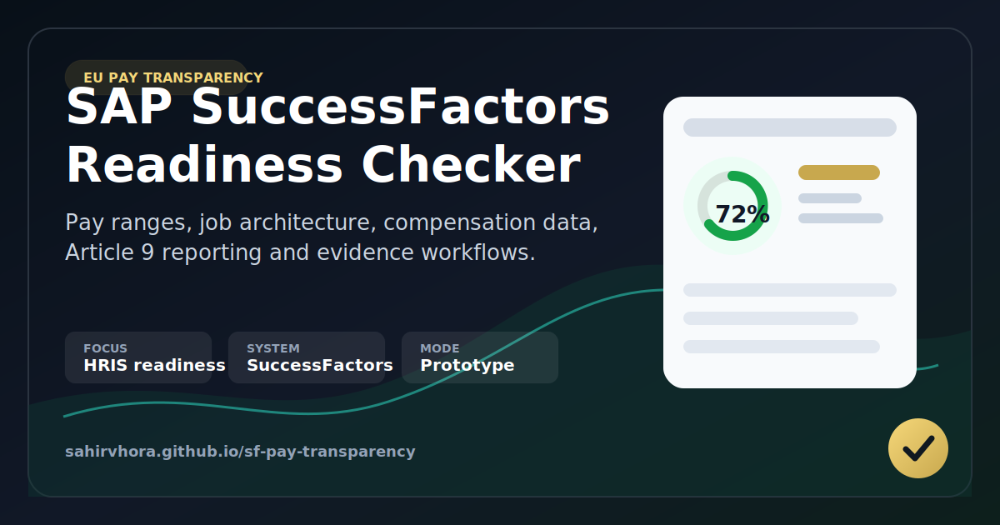

# SF Pay Transparency Readiness Checker

[](https://sahirvhora.github.io/sf-pay-transparency/)

A local SuccessFactors prototype for exploring readiness for the EU Pay Transparency Directive.

The tool turns a broad regulatory topic into practical SuccessFactors questions: do you have pay ranges, usable job architecture, gender and compensation data coverage, worker request workflows, Article 9 reporting readiness, and evidence that can be reviewed?

This is a practitioner readiness aid and discussion prototype. It is not legal advice, a certified compliance product, or a production tenant audit tool.

**Live demo:** https://sahirvhora.github.io/sf-pay-transparency/

**Keywords:** SAP SuccessFactors pay transparency, EU Pay Transparency Directive, HRIS readiness, compensation data quality, pay range disclosure, Article 7 pay information requests, Article 9 gender pay gap reporting, Article 10 joint pay assessment, People Analytics, Reward, SAP HR technology.

## Why This Exists

Many organisations are not blocked by awareness of the EU Pay Transparency Directive. They are blocked by the operational questions underneath it:

- Are pay ranges actually maintained and mapped to jobs or positions?
- Can worker categories be derived consistently enough for analysis?
- Is gender, compensation, employment, job, and position data complete enough to report from?
- Can applicants see pay range information before interview?
- Can workers request individual pay level and average pay levels by sex for the same or equal-value category?
- Can HR, Reward, Legal, People Analytics, and worker representatives see the same evidence trail?

This prototype gives SuccessFactors teams a way to explore those questions in one place.

## What It Covers

- Applicant pay range disclosure for EU job postings.
- Worker Article 7 pay information request readiness.
- Article 9 gender pay gap reporting readiness.
- Article 10 joint pay assessment trigger workflow readiness.
- SuccessFactors configuration paths across Employee Central, Recruiting, People Analytics/WFA/SAC, MDF, Workflow, and RBP.
- A questionnaire-based readiness score for workshops.
- Optional live OData metadata/entity checks through a local backend.
- Prototype evidence pack mode with capped, paginated pulls from resolved OData entities.
- Article 9-style calculations where pay, gender, and worker-category joins are available.

## Quick Start

You can open the UI directly in demo mode:

```bash
open index.html
```

Or start the local backend in demo-safe mode:

```bash
python3 backend_server.py
```

Then open:

```text
http://localhost:8080
```

If port `8080` is busy:

```bash
PORT=8090 python3 backend_server.py
```

Then open:

```text
http://localhost:8090
```

To enable live SuccessFactors OData checks on your own machine, start the backend with explicit live mode:

```bash
SFPT_LIVE_MODE=1 python3 backend_server.py
```

or:

```bash
SFPT_LIVE_MODE=1 PORT=8090 python3 backend_server.py
```

## How It Works

In demo mode, the app works as a guided readiness checklist and workshop tool.

With the local backend running in `SFPT_LIVE_MODE=1`, it can:

1. Fetch SuccessFactors OData `$metadata`.
2. Resolve relevant entities such as `EmpJob`, compensation, employment/person/gender sources, `Position`, job code, pay grade, and pay range where available.
3. Run shallow readiness checks against resolved objects and field coverage.
4. Pull capped evidence samples for the evidence pack.
5. Estimate Article 9 metrics where joins are available.

Raw employee/pay rows are used only in backend memory for calculations. The evidence JSON returns field coverage, selected fields, row counts, masked sample rows, resolved entity names, calculations, and limitations. Article 9-style category metrics are suppressed for small cohorts before display and export.

## Credentials And Data Safety

Connection settings are saved locally by the backend in:

```text
.pay_transparency_credentials.json
```

The file is created with owner-only permissions (`600`) and is ignored by Git. In demo-safe mode, the backend does not expose saved tenant details or call SuccessFactors. In explicit live mode, the browser receives non-secret connection fields and a `hasPassword` flag; the password is not stored in browser `localStorage` or exported reports.

Use **Settings > Clear Local Data** to clear browser state and ask the local backend to delete saved credentials.

This is suitable for local prototype use on your own machine. For shared hosting, replace this with OS keyring, a vault, OAuth, or another approved enterprise credential pattern.

Before sharing screenshots, a branch, or a public repo, remove any local credential file:

```bash
rm -f .pay_transparency_credentials.*
```

See [SECURITY.md](SECURITY.md) for the publishing checklist.

## Important Limitations

- This is not legal advice.
- This is not a certified pay equity calculation.
- Worker category mapping is inferred from available job, position, pay grade, pay range, or related fields and must be validated.
- Article 9-style metrics are prototype calculations only; they do not certify gross annual pay, gross hourly pay, national report formats, full-population coverage, privacy suppression, or a legally approved equal-value methodology.
- Employer reporting thresholds are staged by worker count under the EU baseline and may be stricter under national transposition.
- Country-specific implementation details must be reviewed with qualified HR/legal stakeholders.
- Small-population suppression, privacy rules, and formal equal-value methodology are not production-ready.
- The live checks are readiness probes and capped evidence pulls, not a full tenant audit.

## Intended Audience

This prototype may be useful for:

- SAP SuccessFactors consultants.
- HRIS and People Technology teams.
- Reward and compensation teams.
- People Analytics teams.
- HR compliance and transformation teams preparing for pay transparency workstreams.

## Project Structure

```text
.
├── index.html          # Static single-page UI
├── backend_server.py   # Local backend for OData checks and evidence pack generation
├── proxy_server.py     # Legacy local CORS proxy for browser-only experiments
├── SECURITY.md         # Sharing and data-safety checklist
└── archive/mockup/     # Older visual mockup kept for reference
```

## Development Notes

There is no build step. The active app is `index.html`.

Basic Python syntax check:

```bash
python3 -m py_compile backend_server.py proxy_server.py
```

Demo-mode smoke test:

```bash
python3 scripts/smoke_test.py
```

## Roadmap Ideas

1. Add a real ingestion layer for EC, Compensation, Recruiting, and People Analytics extracts.
2. Add explicit worker-category/equal-value mapping with evidence fields for skills, effort, responsibility, and working conditions.
3. Extend privacy suppression controls with country/legal policy presets.
4. Generate an auditable evidence pack with source tables, calculation timestamp, assumptions, data-quality exceptions, and remediation owner.
5. Add accessibility and screenshot regression checks.

## Disclaimer

Directive interpretation, reporting obligations, employee thresholds, remediation timelines, and national transposition rules may vary by country. Validate all operational use with HR, Reward, Legal, Data Protection, and worker-representative stakeholders.

## Related SAP SuccessFactors tools

This project is part of a wider SAP SuccessFactors supplementary tools suite.

Start with SF Compass for the full hub: https://sahirvhora.github.io/sf-compass/

| Tool | Purpose |
|---|---|
| SF Compass | Feasibility answers, implementation guidance, and links to the full tool suite |
| SF Release Update | Release impact tracking and testing focus |
| SF Pay Transparency | EU Pay Transparency readiness and evidence workflow framing |
| SF Value Navigator | Value realisation and sponsor-facing consulting framework |
| SF Position Integrity Checker | Position hierarchy, incumbency, and EC data-quality validation |
| SAPSF ObjectSync | Controlled foundation-object synchronisation between SF environments |
